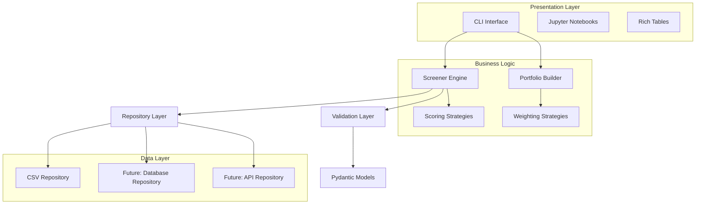
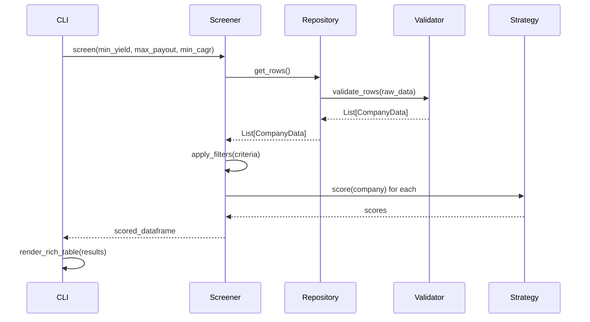
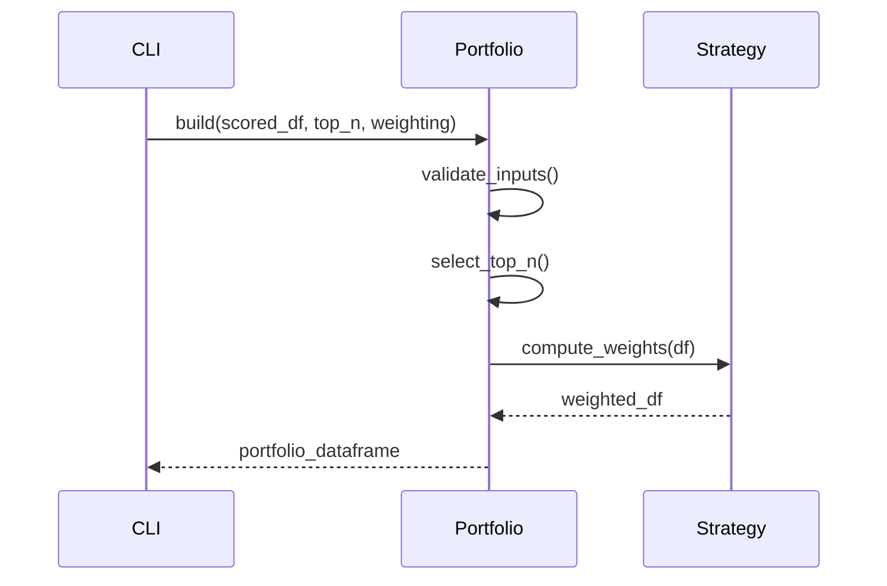
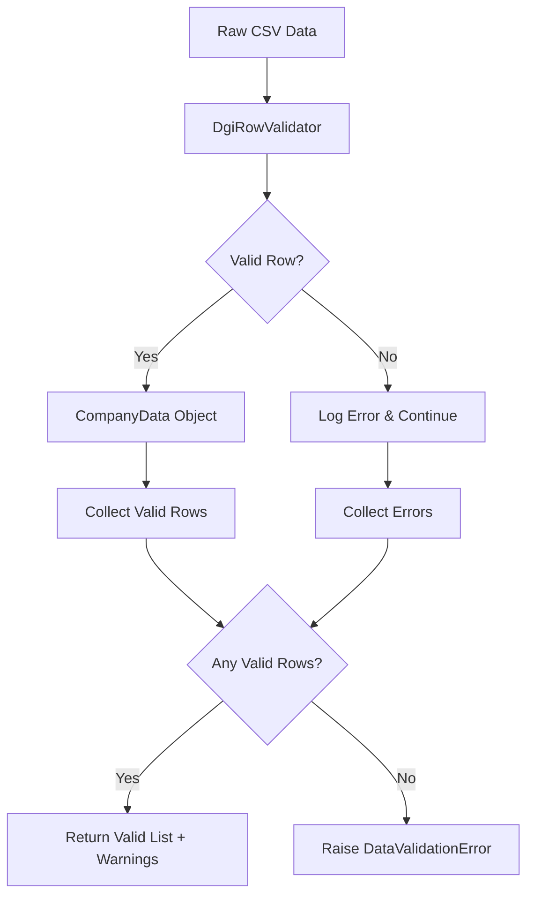

# DGI Toolkit Architecture Overview

This document provides a high-level overview of the DGI Toolkit's architecture, design decisions, and system organization. It serves as a guide for understanding the codebase structure and making informed architectural decisions for future enhancements.

## 🏗️ System Architecture

### High-Level Design



### Architectural Principles

#### 1. **Separation of Concerns**
- **Data Access**: Repository pattern abstracts data sources
- **Business Logic**: Core screening and portfolio logic isolated
- **Presentation**: CLI and notebooks handle user interaction
- **Validation**: Dedicated layer for data quality assurance

#### 2. **Dependency Inversion**
- High-level modules (Screener) depend on abstractions (Repository interface)
- Low-level modules (CsvRepository) implement abstractions
- Enables easy testing and extensibility

#### 3. **Single Responsibility**
- Each class has one reason to change
- `Screener`: Stock filtering and scoring
- `Portfolio`: Weight calculation and statistics
- `CompanyData`: Data model with validation
- `DgiRowValidator`: Data validation orchestration

#### 4. **Open/Closed Principle**
- Open for extension (new strategies, repositories)
- Closed for modification (existing interfaces stable)
- Strategy pattern enables algorithm swapping

---

## 🔧 Design Patterns

### 1. Repository Pattern

**Intent**: Abstract data access to enable different data sources without changing business logic.

```python
# Abstract interface
class CompanyDataRepository(ABC):
    @abstractmethod
    def get_rows(self) -> List[CompanyData]: ...

# Concrete implementation
class CsvCompanyDataRepository(CompanyDataRepository):
    def get_rows(self) -> List[CompanyData]:
        # CSV-specific logic
```

**Benefits:**
- **Testability**: Easy to mock for unit tests
- **Flexibility**: Switch between CSV, database, API sources
- **Maintainability**: Data access changes isolated

**Usage:**
```python
# Dependency injection enables different data sources
csv_repo = CsvCompanyDataRepository("data.csv", validator)
db_repo = DatabaseRepository("postgresql://...")
screener = Screener(csv_repo)  # or db_repo
```

### 2. Strategy Pattern

**Intent**: Enable runtime selection of algorithms for scoring and weighting.

```python
# Abstract strategy
class ScoringStrategy(ABC):
    @abstractmethod
    def score(self, company: CompanyData) -> float: ...

# Concrete strategies
class DefaultScoring(ScoringStrategy): ...
class MomentumScoring(ScoringStrategy): ...
class ESGScoring(ScoringStrategy): ...
```

**Benefits:**
- **Extensibility**: Add new algorithms without changing core code
- **A/B Testing**: Easy to compare different approaches
- **Configuration**: Runtime algorithm selection

**Usage:**
```python
# Strategy selection at runtime
screener = Screener(repo, scoring_strategy=MomentumScoring())
portfolio = build(df, weighting="score")  # Uses ScoreWeighting strategy
```

### 3. Factory Pattern (Implicit)

**Intent**: Create appropriate strategy instances based on string parameters.

```python
# In portfolio.py
strategies = {
    "equal": EqualWeighting(),
    "score": ScoreWeighting(),
}
strategy = strategies[weighting]  # Factory-like behavior
```

**Benefits:**
- **Simplicity**: Easy string-based configuration
- **Extensibility**: Register new strategies in dictionary
- **Type Safety**: Compile-time checking of strategy types

### 4. Template Method Pattern

**Intent**: Define skeleton of validation algorithm with customizable steps.

```python
class DgiRowValidator:
    def validate_rows(self, rows):
        # Template method with fixed steps
        for row in rows:
            try:
                validated = self._strategy.validate(row)  # Customizable step
                valid_rows.append(validated)
            except ValidationError:
                # Fixed error handling
```

**Benefits:**
- **Consistency**: Standard validation workflow
- **Flexibility**: Pluggable validation strategies
- **Error Handling**: Centralized error collection and reporting

---

## 📊 Data Flow

### Stock Screening Pipeline



### Portfolio Construction Pipeline



### Data Validation Flow



---

## 🗂️ Module Organization

### Core Business Logic

#### `dgi/screener.py`
**Responsibility**: Main screening engine and business logic coordination.

**Key Components:**
- `Screener` class: Orchestrates screening workflow
- `load_universe()`: Data loading with validation
- `apply_filters()`: Multi-criteria filtering
- `add_scores()`: Scoring application
- Functional API for backward compatibility

**Dependencies:**
- Repository interfaces for data access
- Validation layer for data quality
- Scoring strategies for ranking

#### `dgi/portfolio.py`
**Responsibility**: Portfolio construction and analysis.

**Key Components:**
- `build()` function: Main portfolio construction
- `WeightingStrategy` implementations
- `summary_stats()`: Portfolio analytics
- Input validation and error handling

**Design Decisions:**
- Functional interface for simplicity
- Strategy pattern for weighting algorithms
- Comprehensive input validation

#### `dgi/models/company.py`
**Responsibility**: Data model with validation and type safety.

**Key Components:**
- `CompanyData` Pydantic model
- Field validation with constraints
- Backward compatibility aliases
- Custom validators for numeric conversion

**Design Decisions:**
- Pydantic v1 for stability and performance
- Alias fields for CSV compatibility
- Strict validation with helpful error messages

### Data Access Layer

#### `dgi/repositories/`
**Responsibility**: Abstract data source access.

**Structure:**
- `base.py`: Abstract `CompanyDataRepository` interface
- `csv.py`: CSV file implementation
- Future: `database.py`, `api.py` implementations

**Design Decisions:**
- Abstract base class for interface definition
- Dependency injection for flexibility
- Validation integration at repository level

#### `dgi/validation.py`
**Responsibility**: Data validation orchestration.

**Key Components:**
- `DgiRowValidator`: Main validation coordinator
- `RowValidationStrategy` protocol
- `PydanticRowValidation`: Pydantic-based implementation
- Error collection and reporting

**Design Decisions:**
- Protocol-based strategy pattern
- Graceful error handling (collect, don't fail fast)
- Detailed error logging with row context

### Presentation Layer

#### `dgi/cli.py`
**Responsibility**: Command-line interface.

**Key Components:**
- Typer-based command definitions
- Parameter validation
- Rich table integration
- Structured JSON logging

**Design Decisions:**
- Typer for modern CLI features
- Rich for professional output
- Environment variable configuration
- Clear error messages with exit codes

#### `dgi/cli_helpers.py`
**Responsibility**: CLI utility functions.

**Key Components:**
- `render_screen_table()`: Rich table rendering
- Color coding and formatting
- Graceful Rich import handling

**Design Decisions:**
- Separate module for testability
- Optional Rich dependency handling
- Professional table styling

### Configuration and Utilities

#### `dgi/config.py`
**Responsibility**: Configuration management.

**Key Components:**
- `Config` class with environment variable support
- Default value specification
- Type conversion and validation

**Design Decisions:**
- Environment variable precedence
- Sensible defaults for development
- Type safety for configuration values

#### `dgi/exceptions.py`
**Responsibility**: Custom exception definitions.

**Key Components:**
- `DataValidationError`: Domain-specific validation failures
- Future: Additional business logic exceptions

**Design Decisions:**
- Inherit from appropriate built-in exceptions
- Clear exception naming and documentation
- Minimal exception hierarchy (avoid over-engineering)

---

## 🔀 Extension Points

### Adding New Data Sources

**Pattern**: Implement `CompanyDataRepository` interface

```python
class APIRepository(CompanyDataRepository):
    def __init__(self, api_endpoint: str, api_key: str):
        self.endpoint = api_endpoint
        self.api_key = api_key
    
    def get_rows(self) -> List[CompanyData]:
        # API-specific implementation
        # Return validated CompanyData objects
```

**Integration:**
```python
# No changes to business logic required
api_repo = APIRepository("https://api.example.com", "key123")
screener = Screener(api_repo)  # Same interface
```

### Adding New Scoring Algorithms

**Pattern**: Implement `ScoringStrategy` interface

```python
class ESGScoring(ScoringStrategy):
    def score(self, company: CompanyData) -> float:
        # ESG-based scoring logic
        # Return 0.0-1.0 score
```

**Integration:**
```python
# Easy strategy swapping
screener = Screener(repo, scoring_strategy=ESGScoring())
```

### Adding New Portfolio Weighting

**Pattern**: Implement `WeightingStrategy` interface and register

```python
class RiskParityWeighting(WeightingStrategy):
    def compute_weights(self, df: DataFrame) -> DataFrame:
        # Risk parity algorithm
        return df

# Register in portfolio.py
strategies = {
    "equal": EqualWeighting(),
    "score": ScoreWeighting(),
    "risk_parity": RiskParityWeighting(),  # New strategy
}
```

### Adding New CLI Commands

**Pattern**: Add Typer command with consistent structure

```python
@app.command()
def backtest(
    start_date: str = typer.Option(..., help="Start date YYYY-MM-DD"),
    end_date: str = typer.Option(..., help="End date YYYY-MM-DD"),
) -> None:
    """Backtest portfolio performance."""
    # Command implementation
```

---

## 🧪 Testing Architecture

### Test Organization

```
tests/
├── __init__.py
├── test_screener.py          # Screener logic tests
├── test_portfolio.py         # Portfolio construction tests
├── test_sample.py           # CLI integration tests
├── test_cli_helpers.py      # CLI utility tests
└── conftest.py              # pytest fixtures (future)
```

### Testing Patterns

#### 1. **Unit Tests**
- Test individual components in isolation
- Mock external dependencies
- Focus on business logic correctness

#### 2. **Integration Tests**
- Test full pipeline workflows
- Use real data sources (small test files)
- Verify end-to-end functionality

#### 3. **Property-Based Testing**
- Test invariants and edge cases
- Parametrized tests for multiple scenarios
- Regression prevention

#### 4. **CLI Testing**
- Subprocess-based CLI invocation
- Exit code and output validation
- Error handling verification

---

## 🚀 Performance Considerations

### Data Processing Efficiency

#### **Pandas Optimization**
```python
# Efficient data loading
df = pd.read_csv(path, dtype=str)  # Load as strings initially
df = df.dropna()  # Early filtering

# Vectorized operations preferred
df['score'] = df['yield'] * 1.0 + df['growth'] * 0.5  # Fast

# Fallback to apply() for complex logic
df['score'] = df.apply(complex_function, axis=1)  # Slower but flexible
```

#### **Memory Management**
- Use `copy()` for DataFrame operations
- Delete large objects when no longer needed
- Batch processing for large datasets

#### **Validation Performance**
- Batch validation vs. row-by-row
- Early validation failure detection
- Efficient error collection

### Scalability Design

#### **Horizontal Scaling**
- Stateless design enables multiple instances
- Repository pattern supports distributed data
- Strategy pattern enables A/B testing at scale

#### **Vertical Scaling**
- Efficient pandas operations
- Minimal object creation in hot paths
- Lazy loading of large datasets

---

## 🔒 Security Architecture

### Input Validation

#### **CLI Parameters**
```python
# Sanitize and validate all inputs
min_yield = max(0.0, min_yield)  # Prevent negative values
csv_path = validate_file_path(csv_path)  # Path traversal protection
```

#### **Data Validation**
```python
# Pydantic provides robust validation
class CompanyData(BaseModel):
    dividend_yield: confloat(ge=0.0, le=100.0)  # Range constraints
    symbol: constr(min_length=1, max_length=10)  # Length limits
```

### File System Security

#### **Path Validation**
```python
# Restrict file access to allowed directories
allowed_dir = Path("data").resolve()
requested_path = Path(csv_path).resolve()
if not str(requested_path).startswith(str(allowed_dir)):
    raise SecurityError("Path traversal attempt detected")
```

### Future Database Security

#### **SQL Injection Prevention**
```python
# Use parameterized queries
cursor.execute(
    "SELECT * FROM companies WHERE sector = %s", 
    (sector,)  # Parameterized to prevent injection
)
```

---

## 📈 Monitoring and Observability

### Logging Strategy

#### **Structured Logging**
```python
# JSON format for machine processing
{
    "level": "INFO",
    "name": "dgi.screener", 
    "message": "Successfully loaded 150 valid rows",
    "timestamp": "2024-01-15T10:30:00Z"
}
```

#### **Log Levels**
- **DEBUG**: Detailed execution flow
- **INFO**: Business operation progress
- **WARNING**: Recoverable issues (invalid data rows)
- **ERROR**: Operation failures requiring attention

### Error Tracking

#### **Exception Context**
```python
# Rich error context for debugging
logger.error(
    "Validation failed for row %d: %s", 
    row_number, 
    error_details,
    extra={"row_data": row_dict}
)
```

### Performance Metrics

#### **Key Metrics to Track**
- Data loading time per record count
- Validation success/failure rates
- Screening execution time
- Portfolio construction performance
- CLI command response times

---

## 🔮 Future Architecture Evolution

### Planned Enhancements

#### **Microservices Architecture**
```
┌─────────────────┐    ┌─────────────────┐    ┌─────────────────┐
│   Data Service  │    │ Screening Service│    │Portfolio Service│
│                 │    │                 │    │                 │
│ - Multiple      │    │ - Filtering     │    │ - Construction  │
│   Data Sources  │    │ - Scoring       │    │ - Analytics     │
│ - Validation    │    │ - Ranking       │    │ - Optimization  │
└─────────────────┘    └─────────────────┘    └─────────────────┘
```

#### **Event-Driven Architecture**
```python
# Future: Event-driven updates
class DataUpdatedEvent:
    def __init__(self, source: str, timestamp: datetime): ...

class ScreeningCompletedEvent:
    def __init__(self, results: DataFrame, criteria: dict): ...
```

#### **Advanced Scoring Models**
```python
# Machine learning integration
class MLScoringStrategy(ScoringStrategy):
    def __init__(self, model_path: str):
        self.model = load_model(model_path)
    
    def score(self, company: CompanyData) -> float:
        features = self.extract_features(company)
        return self.model.predict(features)[0]
```

#### **Real-Time Data Integration**
```python
# Streaming data support
class StreamingRepository(CompanyDataRepository):
    def __init__(self, kafka_config: dict):
        self.consumer = KafkaConsumer(kafka_config)
    
    def get_rows(self) -> List[CompanyData]:
        # Real-time data streaming
```

### Migration Strategy

#### **Backward Compatibility**
- Maintain existing interfaces during transitions
- Deprecation warnings for old APIs
- Gradual migration with feature flags

#### **Database Migration**
- Repository pattern enables smooth transition
- Parallel running of old/new systems
- Data consistency validation

#### **API Versioning**
- Semantic versioning for public interfaces
- Breaking changes in major versions only
- Clear migration documentation

---

This architecture overview provides the foundation for understanding and extending the DGI Toolkit. The modular design and well-defined interfaces enable confident evolution while maintaining system stability and performance. 